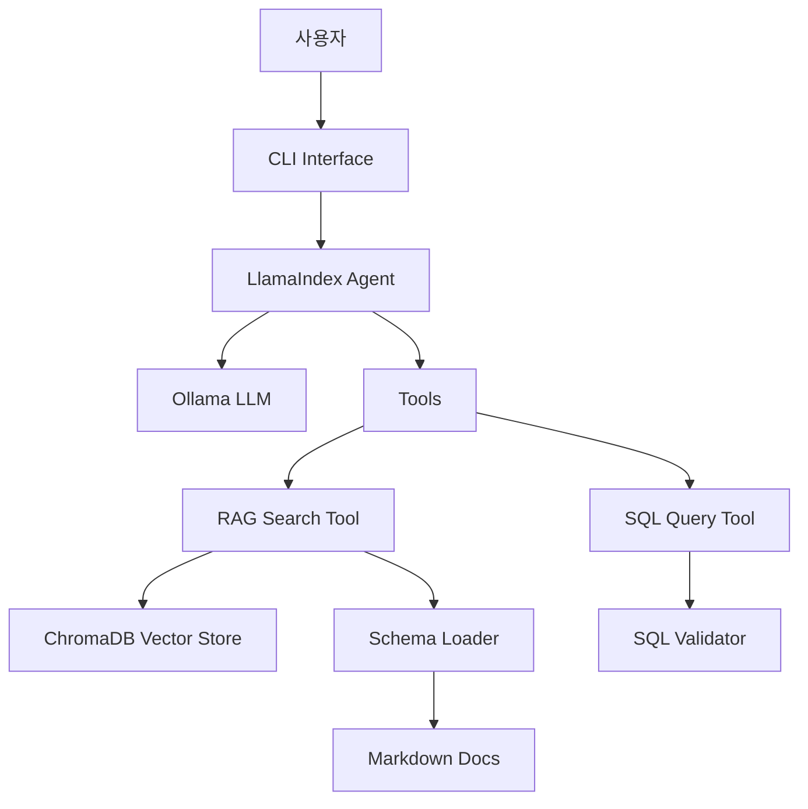

# 🤖 LlamaIndex + Ollama 로컬 LLM 챗봇 프로젝트

## 📋 프로젝트 개요

사내 보안 환경에서 동작하는 **완전 로컬 LLM 기반 데이터베이스 조회 챗봇**입니다.  
외부 API 의존성 없이 Ollama를 통해 로컬에서 LLM을 실행하며, LlamaIndex를 활용해 RAG 기반 정보 검색을 수행합니다.

### 핵심 특징
- 🔒 **완전 로컬 실행** - 인터넷 연결 불필요
- 🚀 **LlamaIndex 통합** - 최신 RAG 프레임워크 활용
- 🛡️ **SQL 보안** - 읽기 전용 쿼리만 허용
- 📚 **동적 스키마** - Markdown 파일에서 자동 로딩
- ⚙️ **설정 기반** - 하드코딩 없음, 모든 값 config.yaml

## 🏗️ 아키텍처



### 주요 컴포넌트

| 컴포넌트 | 역할 | 구현 파일 |
|---------|------|-----------|
| **LLM Agent** | 사용자 쿼리 처리 및 도구 조정 | `agent/core.py` |
| **RAG Search** | 벡터 기반 문서 검색 | `agent/tools.py` |
| **SQL Tool** | 안전한 SQL 쿼리 실행 | `agent/tools.py` |
| **Schema Loader** | 동적 스키마 로딩 | `parsers/schema_loader.py` |
| **Memory Manager** | 대화 컨텍스트 관리 | `agent/memory.py` |

## 💻 기술 스택

### Core
- **Python 3.12+**
- **LlamaIndex** - RAG 프레임워크
- **Ollama** - 로컬 LLM 실행
- **ChromaDB** - 벡터 데이터베이스

### Libraries
```python
llama-index             # Core RAG framework
llama-index-llms-ollama # Ollama integration
llama-index-embeddings-ollama
llama-index-vector-stores-chroma
chromadb               # Vector database
pyyaml                 # Configuration
sqlparse               # SQL validation
rich                   # CLI UI
```

## 🚀 설치 및 실행

### 1. 환경 설정
```bash
# 가상환경 생성
python -m venv .venv

# 활성화 (Windows)
.venv\Scripts\activate

# 패키지 설치
pip install -r requirements.txt
```

### 2. Ollama 설정
```bash
# Ollama 설치 후
ollama pull qwen3:4b              # LLM 모델
ollama pull nomic-embed-text      # 임베딩 모델
ollama serve                       # 서버 시작
```

### 3. 설정 파일
`config.yaml` 수정:
```yaml
ollama:
  host: "http://localhost"
  port: 11434
  model: "qwen3:4b"
  embedding_model: "nomic-embed-text"
```

### 4. 실행
```bash
# 대화형 모드
python main.py

# Verbose 모드
python main.py -v

# 단일 쿼리
python main.py -q "employees 테이블 구조 알려줘"
```

## 📁 프로젝트 구조

```
├── agent/              # 핵심 Agent 모듈
│   ├── core.py        # LlamaIndex Agent
│   ├── tools.py       # RAG & SQL Tools
│   └── memory.py      # 대화 메모리
├── parsers/           # 파서 모듈
│   ├── md_parser.py   # Markdown 파서
│   └── schema_loader.py # 동적 스키마 로더
├── utils/             # 유틸리티
│   ├── config_loader.py # 설정 관리
│   └── logger.py      # 로깅
├── data/              
│   ├── schema_docs/   # DB 스키마 문서 (.md)
│   └── chroma_db/     # 벡터 DB 저장소
├── tests/             # 단위 테스트
├── examples/          # 예제 및 통합 테스트
└── main.py            # 진입점

```

## 🔒 보안 기능

### SQL 쿼리 검증
```python
# SQLValidator가 모든 쿼리 검증
DANGEROUS_KEYWORDS = [
    'INSERT', 'UPDATE', 'DELETE', 'DROP', 
    'CREATE', 'ALTER', 'TRUNCATE', ...
]

# 안전한 쿼리만 허용
SAFE_KEYWORDS = [
    'SELECT', 'WITH', 'SHOW', 'DESCRIBE', ...
]
```

### 보안 정책
- ✅ SELECT 쿼리만 허용
- ❌ 모든 쓰기 작업 차단
- ❌ 다중 쿼리 실행 차단
- ❌ SQL Injection 패턴 차단

## 📊 스키마 관리

### Markdown 스키마 형식
```markdown
---
database: mydb
version: 1.0
---

## employees

직원 정보 테이블

| Column | Type | Key | Description |
|--------|------|-----|-------------|
| id | INT | PK | 직원 ID |
| name | VARCHAR(100) | | 이름 |
| dept_id | INT | FK | 부서 ID |

FK: dept_id -> departments.id
```

### 동적 로딩
- `.md` 파일 변경 시 자동 감지
- YAML front matter로 메타데이터 관리
- 하드코딩 없이 완전 동적 처리

## 🧪 테스트

### 테스트 실행
```bash
# 모든 테스트
python run_tests.py

# 개별 테스트
python tests/test_schema_loader.py

# 통합 테스트
python tests/test_integration.py
```

### 테스트 커버리지
- **단위 테스트**: 50개+
- **통합 테스트**: End-to-end 시나리오
- **성능 테스트**: 응답 시간 검증

## 📈 성능 최적화

### 현재 성능
- 스키마 로딩: 50개 테이블 < 5초
- SQL 검증: ~15ms (목표: <10ms)
- RAG 검색: 상위 5개 결과 < 1초

### 최적화 전략
1. **인덱스 캐싱** - 재사용으로 로딩 시간 단축
2. **배치 임베딩** - 다중 문서 동시 처리
3. **쿼리 캐싱** - 자주 사용되는 쿼리 캐싱

## 🔧 설정 관리

### config.yaml 구조
```yaml
ollama:           # LLM 설정
  model: "qwen3:4b"
  temperature: 0.7
  
vector_store:     # ChromaDB 설정
  path: "./data/chroma_db"
  
agent:            # Agent 동작 설정
  verbose: true
  max_context_messages: 5
  
sql:              # SQL 보안 설정
  allow_write: false  # 항상 false
  
rag:              # RAG 설정
  chunk_size: 512
  top_k: 5
```

### 환경별 설정
- `config.yaml` - 기본 설정
- `config.local.yaml` - 로컬 개발
- `config.prod.yaml` - 프로덕션

## 🐛 문제 해결

### Ollama 연결 실패
```bash
# Ollama 서버 확인
curl http://localhost:11434/api/tags

# 모델 확인
ollama list
```

### ChromaDB 오류
```bash
# ChromaDB 초기화
rm -rf data/chroma_db
python main.py --rebuild-index
```

### 인코딩 문제 (Windows)
```python
# 자동으로 처리됨 (main.py)
sys.stdout = codecs.getwriter('utf-8')(sys.stdout.buffer)
```

## 📝 로드맵

### 완료 ✅
- LlamaIndex 통합
- ChromaDB RAG 구현
- SQL 보안 검증
- 동적 스키마 로더
- CLI 인터페이스

### 진행 중 🚧
- 실제 DB 연결 어댑터
- 성능 최적화

### 계획 📋
- Web UI (FastAPI/Gradio)
- 다중 에이전트 지원
- 스트리밍 응답
- 프롬프트 엔지니어링 최적화

## 🤝 기여 가이드

### 코드 스타일
- Black 포매터 사용
- Type hints 필수
- Docstring 작성

### 테스트
- 새 기능은 테스트 필수
- 커버리지 80% 이상 유지

### 커밋 메시지
```
feat: 새로운 기능
fix: 버그 수정
docs: 문서 업데이트
test: 테스트 추가
refactor: 코드 개선
```

## 📄 라이센스

내부 프로젝트 - 외부 공개 금지

## 👥 팀

- 개발: AI Assistant (Claude)
- 검토: 프로젝트 팀

---

*최종 업데이트: 2024.12*